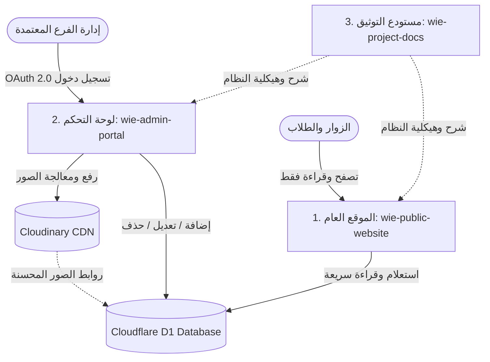

# 💜 IEEE WIE - Al-Huson Student Branch
> **مجتمع النساء في الهندسة (IEEE Women in Engineering) - كلية الحصن الجامعية**

مرحباً بك في المستودع التوثيقي الرئيسي لمشروع مجتمع **IEEE WIE Al-Huson**. تم تصميم وهندسة هذا النظام الرقمي وفق أحدث معايير الويب السحابية بهيكلية مفصولة (**Decoupled Architecture**) لضمان أقصى درجات الأمان والسرعة والاستقلالية.

---

## 🏗️ هيكلية المشروع (Project Architecture)

يتكون النظام الرقمي لـ IEEE WIE من **3 مستودعات برمجية مستقلة**:



---

## 📦 المستودعات الثلاثة (The 3 Repositories)

### 1. `wie-project-docs` (هذا المستودع - Public)
- **الهدف:** توثيق شامل لبنية المشروع، أدلة النشر، والرسوم البيانية الهندسية.
- **الجمهور:** المطورون، أعضاء الفرع، والمهتمون بالتعرف على البنية التقنية.

### 2. `wie-public-website` (الموقع العام - Public Repo)
- **الهدف:** الواجهة التفاعلية الرسمية للزوار والطلاب لعرض أنشطة وإنجازات وإحصائيات الفرع وحجز الفعاليات.
- **التقنيات:** `Astro v5` + `React 19` + `Tailwind CSS v4` + `Cloudflare Pages`.
- **مستوى الأمان:**
  - قراءة فقط (**Read-Only**) لقاعدة البيانات السحابية.
  - خالٍ تماماً من أي مفاتيح سرية أو صلاحيات كتابة.
  - جميع نقاط الـ API داخل هذا المستودع تدعم فقط طلبات `GET`.

### 3. `wie-admin-portal` (لوحة التحكم الإدارية - Private Repo)
- **الهدف:** بوابة الإدارة الحصرية للفرع لإدارة الفعاليات، لوحة الشرف، الإنجازات، الإحصائيات، ورفع الصور.
- **التقنيات:** `Astro` + `Auth.js (v5)` + `Google OAuth 2.0` + `Cloudinary SDK` + `Drizzle ORM`.
- **مستوى الأمان:**
  - مصادقة سحابية صارمة عبر **Google OAuth 2.0** مقيدة حصرياً ببريد الفرع المعتمد: `ieeealhusonwie@gmail.com`.
  - جدار ناري سحابي (`middleware.ts`) يغلق كافة الواجهات ونقاط الـ API ضد أي طلب غير مصادق عليه.
  - تخزين المفاتيح الحساسة في ملف `.env` المحمي ولا يتم رفعها إلى Git.

---

## 🗄️ البنية التحتية السحابية (Cloud Infrastructure)

| الخدمة | الدور والوظيفة |
| :--- | :--- |
| **Cloudflare Pages** | استضافة ونشر الموقع العام ولوحة التحكم كخدمات سحابية موزعة عالمياً (Edge). |
| **Cloudflare D1** | قاعدة بيانات سحابية علائقية مشتركة بدون خادم (`wie-db`) تخدم كلا المشروعين. |
| **Cloudinary** | تخزين وتوزيع ومعالجة الصور المرفوعة وتحسين أبعادها وصيغها تلقائياً. |
| **Google Cloud OAuth** | إدارة هويات المدراء والمصادقة الموحدة ببروتوكول OAuth 2.0. |

---

## 🚀 دليل التشغيل المحلي (Local Development)

### 1. تشغيل الموقع العام (`wie-public-website`):
```bash
cd wie-public-website
npm install
npm run dev
```

### 2. تشغيل لوحة التحكم (`wie-admin-portal`):
```bash
cd wie-admin-portal
npm install
# تأكد من تجهيز ملف .env بناءً على .env.example
npm run dev
```

---

## 🔐 سياسة الأمان وحماية البيانات
- **لا توجد كلمات مرور محلية:** تم التخلي عن كلمات المرور التقليدية لصالح المصادقة السحابية المشفرة عبر Google OAuth.
- **تصفير مساحة التخزين المحلي:** لا يتم حفظ أي صور أو ملفات على الخادم؛ كافة الوسائط تُرفع مباشرة إلى Cloudinary CDN.
- **عزل تام للصلاحيات:** الموقع العام لا يملك أي وسيلة برمجية للكتابة أو التعديل في قاعدة البيانات.

---

> تم بناء وتطوير النظام بكل فخر لدعم رائدات الهندسة في **جامعة البلقاء التطبيقية - كلية الحصن الجامعية**. 💜
